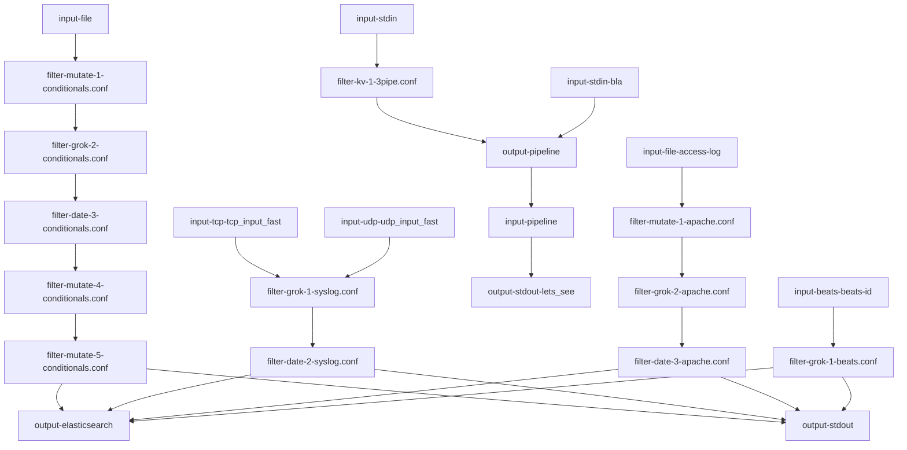

```mermaid
flowchart TD
input-file-->filter-mutate-1-conditionals.conf
filter-mutate-1-conditionals.conf --> filter-grok-2-conditionals.conf
filter-grok-2-conditionals.conf --> filter-date-3-conditionals.conf
filter-date-3-conditionals.conf --> filter-mutate-4-conditionals.conf
filter-mutate-4-conditionals.conf --> filter-mutate-5-conditionals.conf
filter-mutate-5-conditionals.conf --> output-elasticsearch
filter-mutate-5-conditionals.conf --> output-stdout
input-tcp-tcp_input_fast-->filter-grok-1-syslog.conf
input-udp-udp_input_fast-->filter-grok-1-syslog.conf
filter-grok-1-syslog.conf --> filter-date-2-syslog.conf
filter-date-2-syslog.conf --> output-elasticsearch
filter-date-2-syslog.conf --> output-stdout
input-pipeline --> output-stdout-lets_see
input-stdin-->filter-kv-1-3pipe.conf
filter-kv-1-3pipe.conf --> output-pipeline
input-file-access-log-->filter-mutate-1-apache.conf
filter-mutate-1-apache.conf --> filter-grok-2-apache.conf
filter-grok-2-apache.conf --> filter-date-3-apache.conf
filter-date-3-apache.conf --> output-elasticsearch
filter-date-3-apache.conf --> output-stdout
input-stdin-bla --> output-pipeline
input-beats-beats-id-->filter-grok-1-beats.conf
filter-grok-1-beats.conf --> output-elasticsearch
filter-grok-1-beats.conf --> output-stdout
output-pipeline --> input-pipeline
```
